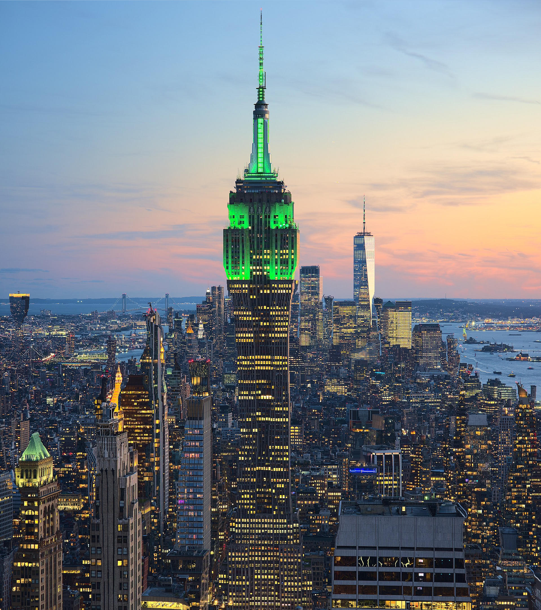
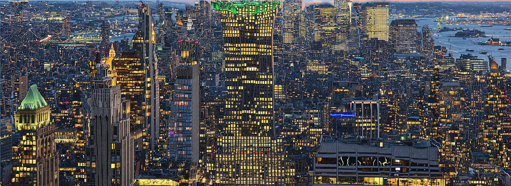

# Seam Stitching

Seam Stitching is a Rust implementation of the **Seam Carving** algorithm, used for content-aware image resizing. Unlike standard scaling, seam carving removes pixels along paths (seams) of low energy (low visual importance), allowing the image to be resized while preserving important features.

## 🤖 AI Attribution
This repository was developed completely with **Gemma 4** (specifically the [Intel/gemma-4-31B-it-int4-AutoRound](https://huggingface.co/Intel/gemma-4-31B-it-int4-AutoRound) model) running on an **RTX 5090**.

## Features

- **Content-Aware Resizing**: Reduces width and height by removing low-energy seams.
- **Vertical and Horizontal Seams**: Supports resizing in both dimensions.
- **Command Line Interface**: Easy-to-use CLI for processing images.

## Installation

Ensure you have Rust and Cargo installed. Then, clone the repository and build the project:

```bash
git clone <repository-url>
cd seam-stitching
cargo build --release
```

## Usage

You can use the compiled binary to resize images. Run the following command:

```bash
cargo run -- --input input.jpg --output output.jpg --width 800 --height 600
```

## Examples & Comparison

The following examples demonstrate the effectiveness of the hybrid energy model in preserving structural integrity during content-aware resizing.

### Balloons
**Goal**: Remove background while preserving circular shapes.

| Input (1000px) | Output (750px) | Output (500px) |
| :---: | :---: | :---: |
|  |  |  |

**Effect**: The algorithm intelligently identifies the flat blue areas as low-energy and removes them, while the structural energy of the balloons prevents distortion or "squishing" across different reduction levels.

### Cityscape
**Goal**: Reduce width while maintaining vertical architectural lines.

| Input | Output |
| :---: | :---: |
|  |  |

**Effect**: Vertical edges of buildings are preserved as high-energy regions, ensuring the city's perspective remains intact while the width is reduced by removing gaps between structures.

### Comparison Summary

| Image | Challenge | Result |
| :--- | :--- | :--- |
| **Balloons** | Circular preservation | Distortion-free reduction of background |
| **Cityscape** | Vertical structural integrity | Perspective-preserving width reduction |

### Limitations

Seam carving is highly effective when low-energy "empty" space exists. However, in images where every pixel is part of a significant structural edge (high energy across the entire image), the algorithm is forced to remove higher-energy seams.

**Extreme Reduction**:


**Result**: When the reduction target is too aggressive and no true low-energy seams remain, the algorithm begins removing essential structural pixels, leading to visible "squishing" and distortion.

### Arguments

- `-i, --input <path>`: Path to the input image.
- `-o, --output <path>`: Path where the resized image will be saved.
- `-w, --width <u32>`: Target width for the image (optional).
- `-H, --height <u32>`: Target height for the image (optional).

## How it Works

1. **Energy Map**: The algorithm calculates an energy map of the image based on the gradient of pixel intensity. High-energy areas (edges, textures) are preserved, while low-energy areas (flat backgrounds) are candidates for removal.
2. **Seam Identification**: Using dynamic programming, the algorithm finds the path (seam) from top to bottom (or left to right) with the lowest cumulative energy.
3. **Seam Removal**: The identified seam is removed from the image, and the process repeats until the target dimensions are achieved.

## WebAssembly (Wasm) Support

This project supports running in the browser via WebAssembly, allowing for fast, client-side image resizing without uploading data to a server.

**Live Demo**: [https://software-factory-vibe-city.github.io/seam-carving/](https://software-factory-vibe-city.github.io/seam-carving/)

### 🌐 Browser Version Note
The browser version is provided for demonstration and accessibility. Please note:
- **Performance**: The Wasm version is slower than the native CLI implementation due to the "Marshalling Tax" (data copying between JavaScript and Wasm) and the current limitations of multi-threading in the browser.
- **Stability**: The browser implementation might be a little buggy. If you encounter rendering issues, ensure you are using a modern browser that supports Web Workers and Wasm.

### Building for the Web

To compile the project to Wasm, you will need `wasm-pack` installed.

1. **Install wasm-pack**:
   ```bash
   curl https://rustwasm.github.io/wasm-pack/installer/init.sh -sSf | sh
   ```

2. **Build the package**:
   ```bash
   wasm-pack build --target web
   ```

This will generate a `docs/pkg/` directory containing the compiled `.wasm` binary and the JavaScript glue code.

### Integration

The Wasm module provides `resize_width_wasm` and `resize_height_wasm` functions. These functions accept raw byte arrays and a JavaScript callback function to track progress in real-time.

An example implementation is provided in `docs/index.html`. To run it:
1. Build the Wasm package as shown above.
2. Serve the project directory using a local web server (e.g., `python3 -m http.server` or `live-server`).
3. Open `docs/index.html` in your browser.

## Dependencies

- `image`: Used for image processing and manipulation.
- `clap`: Used for command-line argument parsing.
